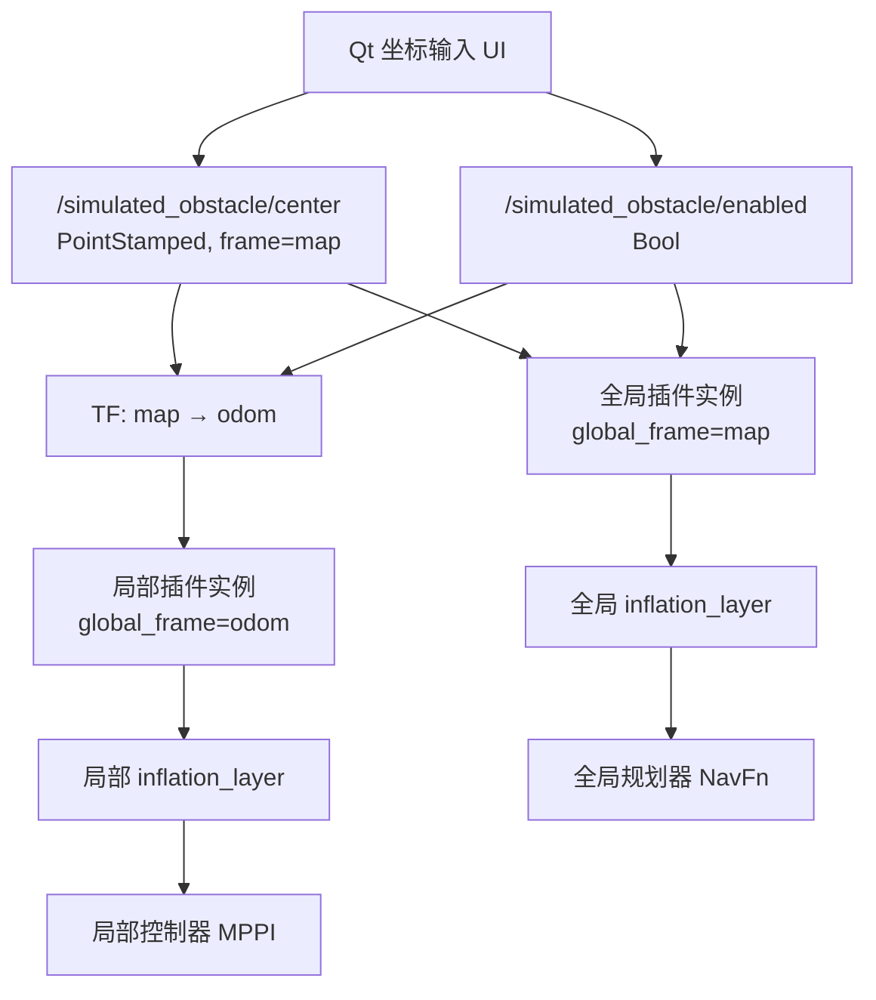

# Nav2 圆形模拟障碍物插件部署、验收与 Agent 排错说明

> 适用项目：`navigation_sim_origin`  
> 适用环境：Ubuntu 24.04、ROS 2 Jazzy、Nav2  
> 目标读者：负责人工部署的开发者，以及负责检查部署、分析报错和做最小修正的本地代码 Agent

## 1. 文档目标

本功能允许操作者在 Qt 界面中输入一个 `map` 坐标系下的二维坐标，并在 Nav2 全局、局部二维代价地图中生成一个圆形模拟障碍物。圆形致命区域半径由 `nav2_params.yaml` 配置，坐标和启停状态通过 ROS 2 话题持续更新。

本说明要求本地 Agent 完成以下工作：

1. 检查人工复制、解压、合并配置是否正确。
2. 理解插件的数据流、TF 转换、栅格更新和膨胀层关系。
3. 执行包级构建和运行验收。
4. 根据实际报错做证据驱动的最小调整。
5. 不覆盖仓库中与本功能无关的未提交修改。

## 2. 给本地 Agent 的强制工作规则

本地 Agent 开始操作前必须遵守：

1. 先阅读仓库根目录的 `AGENTS.md` 和可能存在的嵌套规则文件。
2. 先执行 `git status --short` 和相关文件的 `git diff`，识别用户原有修改。
3. 禁止使用 `git reset --hard`、`git checkout -- <file>` 或覆盖整个工作区。
4. 只处理本功能涉及的两个新包和三个 bringup 文件，不顺手重构其他模块。
5. 诊断报错时，每一轮只先给出或执行 **1～2 个最有信息量的检查**；获得用户反馈后再继续归因，不一次罗列大量排查方法。
6. 修复前先说明“证据、最可能原因、准备修改的文件”，然后做最小改动。
7. 如果 ROS 发行版不是 Jazzy，先报告版本差异，不要未经验证直接批量改 API。

建议 Agent 首轮检查仅执行：

```bash
git status --short
echo "ROS_DISTRO=${ROS_DISTRO}" && colcon list | rg 'simulated_obstacle|bringup'
```

## 3. 交付物与目标路径

| 交付物 | 部署后的目标路径 | 作用 |
| --- | --- | --- |
| `simulated_obstacle_layer/` | `src/navigation/simulated_obstacle_layer/` | Nav2 C++ 代价地图插件 |
| `simulated_obstacle_gui/` | `src/navigation/simulated_obstacle_gui/` | Qt 坐标输入和话题发布节点 |
| `nav2_params_with_simulated_obstacle.yaml` | `src/bringup/params/nav2_params.yaml` | 全局、局部代价地图插件配置 |
| `startup_with_simulated_obstacle.launch.py` | `src/bringup/launch/startup.launch.py` | 随总启动自动打开 UI |
| `bringup_package_with_simulated_obstacle.xml` | `src/bringup/package.xml` | 声明两个新包的运行依赖 |
| `nav2_params_simulated_obstacle.patch` | 不要求放入源码 | 仅用于把功能配置最小合并到现有 YAML |

人工部署时优先采用“对比后合并”，不要盲目覆盖带有其他未提交修改的 `nav2_params.yaml`、`startup.launch.py` 和 `package.xml`。

## 4. 总体原理



### 4.1 为什么同时挂到全局和局部代价地图

- 只挂全局：NavFn 可以重新规划绕开障碍，但 MPPI 的局部碰撞评价没有这个障碍的直接代价信息。
- 只挂局部：MPPI 可以临时避让，但全局路径仍可能反复穿过障碍，局部窗口有限时容易出现绕不过去或反复重试。
- 同时挂载：全局路径负责从整体上绕开，局部控制器负责执行阶段的即时碰撞约束。这是当前实现采用的方案。

### 4.2 坐标系处理

当前项目中：

- 全局代价地图的 `global_frame` 是 `map`。
- 局部代价地图的 `global_frame` 是 `odom`，并且是 `5 m × 5 m` 的滚动窗口。
- UI 始终发布 `map` 坐标。
- 全局插件实例直接使用 `map` 坐标。
- 局部插件实例通过 TF 查询最新的 `map → odom` 变换，再把圆心写入局部栅格。

局部代价地图只会显示进入其滚动窗口范围的圆形障碍物。障碍物远离机器人时“全局有、局部没有”是正常现象，并不表示插件失效。

### 4.3 话题接口

| 话题 | 消息类型 | 含义 |
| --- | --- | --- |
| `/simulated_obstacle/center` | `geometry_msgs/msg/PointStamped` | 圆心坐标；`header.frame_id` 默认是 `map` |
| `/simulated_obstacle/enabled` | `std_msgs/msg/Bool` | `true` 绘制，`false` 移除 |

UI 发布端使用 Reliable + Transient Local QoS，并默认以 10 Hz 持续发布。插件订阅端使用 Reliable + Volatile QoS，既能接收 UI，也能接收普通的 `ros2 topic pub` 测试消息。

### 4.4 栅格更新原理

插件继承 `nav2_costmap_2d::CostmapLayer`，核心过程如下：

1. 缓存最新圆心和启停状态。
2. 在当前代价地图更新周期，把圆心变换到该代价地图的 `global_frame`。
3. 清除插件层中上一位置的圆形栅格。
4. 遍历圆外接矩形内的栅格中心，将满足

   $$
   (x-x_c)^2+(y-y_c)^2\le r^2
   $$

   的栅格写为配置代价，默认是 `254`，即致命障碍物。
5. 把旧圆和新圆的范围都加入本轮更新边界，保证圆心移动后旧投影能够消失。
6. 使用 `updateWithMax` 与主代价地图合并，不覆盖静态地图中更高的既有代价。
7. 后续 `inflation_layer` 对致命圆继续生成膨胀代价。

如果 TF 暂时查询失败，插件会保留最后一次有效圆心，而不是让一个已知障碍瞬间消失；日志会以限频方式报告 TF 错误。

### 4.5 半径与膨胀半径的区别

当前配置：

```yaml
simulated_obstacle_layer:
  radius: 0.40
  cost: 254
```

`radius: 0.40` 表示致命圆本体半径，不是最终所有非零代价格的总半径。插件后面的 `inflation_layer` 还会产生渐变代价：

- 局部层 `inflation_radius: 0.40`。
- 全局层 `inflation_radius: 0.50`。

因此 RViz 中看到的有色区域会比直径 `0.80 m` 的致命圆更大。不要因为膨胀区域更大就误判圆形绘制算法错误。

## 5. 人工部署步骤

### 5.1 检查工作区和 ROS 环境

```bash
cd ~/ros_ws/navigation_sim_origin
git status --short

source /opt/ros/jazzy/setup.bash
echo "$ROS_DISTRO"
```

预期 `ROS_DISTRO` 为 `jazzy`。如果工作区实际路径不同，以本机路径为准。

### 5.2 解压两个功能包

把两个压缩包解压后，确保不是多套了一层目录。正确结构应为：

```text
src/navigation/simulated_obstacle_layer/
├── CMakeLists.txt
├── package.xml
├── simulated_obstacle_layer_plugins.xml
├── include/simulated_obstacle_layer/simulated_obstacle_layer.hpp
└── src/simulated_obstacle_layer.cpp

src/navigation/simulated_obstacle_gui/
├── package.xml
├── setup.py
├── setup.cfg
├── launch/simulated_obstacle_gui.launch.py
└── simulated_obstacle_gui/main.py
```

检查命令：

```bash
colcon list | rg 'simulated_obstacle_layer|simulated_obstacle_gui'
```

必须能看到两个包，且路径分别指向 `src/navigation/` 下的对应目录。

### 5.3 合并 `nav2_params.yaml`

文件位置：

```text
src/bringup/params/nav2_params.yaml
```

局部代价地图必须保持插件顺序：

```yaml
plugins: ["static_layer", "simulated_obstacle_layer", "inflation_layer"]
```

局部参数块：

```yaml
simulated_obstacle_layer:
  plugin: "simulated_obstacle_layer::SimulatedObstacleLayer"
  enabled: true
  center_topic: /simulated_obstacle/center
  enabled_topic: /simulated_obstacle/enabled
  radius: 0.40
  cost: 254
  transform_tolerance: 0.10
```

全局代价地图也必须使用相同的插件顺序和参数块。插件一定要放在 `inflation_layer` 之前，否则模拟圆不会参与后续膨胀。

最小补丁应用方式：

```bash
git apply --check /path/to/nav2_params_simulated_obstacle.patch
git apply /path/to/nav2_params_simulated_obstacle.patch
```

如果 `--check` 失败，说明本地 YAML 上下文和交付版本不同。此时 Agent 应人工对比并只合并两处插件列表、两处参数块，不要强制应用补丁。

### 5.4 检查 `bringup/package.xml`

文件中应包含：

```xml
<exec_depend>simulated_obstacle_gui</exec_depend>
<exec_depend>simulated_obstacle_layer</exec_depend>
```

这保证构建 bringup 时两个运行包被纳入依赖关系。

### 5.5 检查 `startup.launch.py`

文件位置：

```text
src/bringup/launch/startup.launch.py
```

应定义：

```python
simulated_obstacle_gui = IncludeLaunchDescription(
    PythonLaunchDescriptionSource(
        os.path.join(
            get_package_share_directory('simulated_obstacle_gui'),
            'launch',
            'simulated_obstacle_gui.launch.py',
        )
    ),
    launch_arguments={'use_sim_time': 'true'}.items(),
)
```

并在最终的 `LaunchDescription([...])` 中包含：

```python
simulated_obstacle_gui,
```

不要同时手动执行 UI launch，否则可能出现两个同名节点和两个 UI 窗口。

### 5.6 安装依赖

优先使用 rosdep：

```bash
source /opt/ros/jazzy/setup.bash
rosdep install -r --from-paths src --ignore-src --rosdistro jazzy -y
```

如果仅缺少 Qt 绑定，再安装：

```bash
sudo apt update
sudo apt install ros-jazzy-python-qt-binding
```

Agent 不应在没有明确缺包证据时随意安装或更换大量依赖。

### 5.7 定向构建

先只构建本功能相关包，避免被工作区其他已知失败包干扰：

```bash
source /opt/ros/jazzy/setup.bash

colcon build --symlink-install \
  --packages-select simulated_obstacle_layer simulated_obstacle_gui bringup \
  --event-handlers console_direct+
```

构建成功后：

```bash
source install/setup.bash
ros2 pkg prefix simulated_obstacle_layer
ros2 pkg prefix simulated_obstacle_gui
```

如果修改过已安装的同名旧包，可在确认准确目标后，仅清理这三个包对应的 `build/`、`install/` 目录再重新构建；禁止清空整个工作区。

## 6. 启动与运行验收

### 6.1 启动

```bash
source /opt/ros/jazzy/setup.bash
source install/setup.bash
ros2 launch bringup startup.launch.py
```

`startup.launch.py` 会自动启动模拟障碍物 UI。仿真环境保持 `use_sim_time:=true`；实车没有 `/clock` 时，应把 UI launch 的 `use_sim_time` 改为 `false`。

### 6.2 首轮运行检查

只先执行下面两个检查：

```bash
ros2 node list | rg 'simulated_obstacle|local_costmap|global_costmap'
ros2 topic info -v /simulated_obstacle/center
```

预期：

- 能看到 `/simulated_obstacle_gui`。
- `/simulated_obstacle/center` 有一个 GUI 发布者，以及全局、局部两个插件订阅者。
- 消息类型是 `geometry_msgs/msg/PointStamped`。

然后再检查启停话题：

```bash
ros2 topic info -v /simulated_obstacle/enabled
ros2 topic echo --once /simulated_obstacle/center
```

### 6.3 RViz 验收

在 RViz 中分别显示：

- `/global_costmap/costmap`
- `/local_costmap/costmap`

建议测试步骤：

1. 在 UI 中输入一个机器人附近、静态地图原本为空的 `map` 坐标。
2. 勾选“在代价地图中启用障碍物”。
3. 点击“应用并发布”。
4. 确认全局代价地图出现圆形障碍及膨胀区。
5. 当该坐标进入机器人周围 `5 m × 5 m` 局部窗口时，确认局部代价地图也出现投影。
6. 修改 X/Y，确认新位置出现、旧位置清除。
7. 点击“移除障碍物”，确认两个代价地图中的模拟障碍消失。
8. 下发一条原本穿过该坐标的导航目标，确认全局路径绕开、MPPI 不穿过致命圆。

### 6.4 不使用 UI 的最小话题测试

必须先发布圆心，再发布启用状态：

```bash
ros2 topic pub --once /simulated_obstacle/center \
  geometry_msgs/msg/PointStamped \
  "{header: {frame_id: map}, point: {x: 1.0, y: 1.0, z: 0.0}}"

ros2 topic pub --once /simulated_obstacle/enabled \
  std_msgs/msg/Bool "{data: true}"
```

移除：

```bash
ros2 topic pub --once /simulated_obstacle/enabled \
  std_msgs/msg/Bool "{data: false}"
```

## 7. 完整验收清单

本地 Agent 最终应逐项报告：

- [ ] 两个新包位于 `src/navigation/`，没有多套目录。
- [ ] `colcon list` 能发现两个包。
- [ ] 局部、全局插件顺序均为静态层 → 模拟障碍层 → 膨胀层。
- [ ] 两个插件实例的半径、话题名一致。
- [ ] `bringup/package.xml` 声明两个运行依赖。
- [ ] `startup.launch.py` 只启动一个 UI 实例。
- [ ] 三个相关包定向构建成功。
- [ ] 启动时没有 pluginlib 类加载错误。
- [ ] 两个话题都有一个发布者、两个订阅者。
- [ ] 圆心移动后旧圆消失。
- [ ] `enabled=false` 后圆形投影消失。
- [ ] 全局地图始终可见；局部地图在障碍进入滚动窗口后可见。
- [ ] 全局路径能够绕开，局部 MPPI 不穿越致命圆。

## 8. Agent 的分阶段诊断流程

### 阶段 A：确定失败层级

Agent 首先只回答以下问题：

1. 失败发生在包发现、CMake 配置、C++ 编译、Python 启动、pluginlib 加载、TF、话题还是代价地图显示阶段？
2. 第一条真正的错误是什么？后续连锁错误暂不作为根因。

首轮只要求用户提供：

```bash
echo "$ROS_DISTRO"
colcon build --symlink-install --packages-select simulated_obstacle_layer simulated_obstacle_gui bringup --event-handlers console_direct+
```

如果是运行故障，则首轮只要求：

```bash
ros2 node list | rg 'simulated_obstacle|costmap'
ros2 topic info -v /simulated_obstacle/center
```

### 阶段 B：给出证据化结论

每轮回复采用：

```text
当前证据：
最可能原因：
本轮只做的 1～2 个检查：
等待反馈后再决定是否修改：
```

### 阶段 C：最小修改并回归

修改后至少执行：

```bash
colcon build --symlink-install --packages-select <被修改包>
colcon test --packages-select <被修改包> --event-handlers console_direct+
colcon test-result --all --verbose
```

如果包没有注册测试，应明确说明，并执行 Python 语法、XML/YAML 解析或运行验收作为补充，不能把“没有测试”写成“测试通过”。

## 9. 常见故障、首轮检查与允许调整

下面每种故障只列首轮最有价值的 1～2 个检查。本地 Agent 应先执行对应检查，不能把整张表一次性丢给用户。

### 9.1 `Package 'simulated_obstacle_gui' not found`

首轮检查：

```bash
colcon list | rg simulated_obstacle
source install/setup.bash && ros2 pkg prefix simulated_obstacle_gui
```

最可能原因：包解压层级错误、没有构建、构建后没有 source 当前工作区。

允许调整：把包移动到正确目录，定向重新构建并重新 source。不要修改 launch 来绕过缺包。

### 9.2 CMake 找不到 `nav2_costmap_2d`、`pluginlib` 或 `tf2_geometry_msgs`

首轮检查：

```bash
echo "$ROS_DISTRO"
source /opt/ros/jazzy/setup.bash && ros2 pkg prefix nav2_costmap_2d
```

最可能原因：没有 source Jazzy、依赖未安装、终端混入其他 ROS 发行版。

允许调整：正确 source 后用 rosdep 安装缺失依赖。不要先改 CMake 包名。

### 9.3 `Failed to create layer`、`ClassLoader` 或找不到 `SimulatedObstacleLayer`

首轮检查：

```bash
ros2 pkg prefix simulated_obstacle_layer
find install/simulated_obstacle_layer -maxdepth 5 -type f | sort
```

应能看到共享库和 `simulated_obstacle_layer_plugins.xml`。同时确认 YAML 中类名严格为：

```text
simulated_obstacle_layer::SimulatedObstacleLayer
```

最可能原因：插件包没成功安装、XML 类名和 C++ 导出不一致、终端 source 到旧工作区。

允许调整：重新构建插件包；只有在实际文件名不匹配时才同步修正 CMake、插件 XML 和 YAML。

### 9.4 UI 报 `No module named python_qt_binding`

首轮检查：

```bash
echo "$ROS_DISTRO"
python3 -c 'import python_qt_binding; print(python_qt_binding.__file__)'
```

允许调整：安装 `ros-jazzy-python-qt-binding`，并确认使用的是 ROS 环境中的系统 Python，不要在未知虚拟环境中混装 PyQt。

### 9.5 UI 报 `could not connect to display` 或没有窗口

首轮检查：

```bash
echo "DISPLAY=$DISPLAY WAYLAND_DISPLAY=$WAYLAND_DISPLAY"
ros2 node list | rg simulated_obstacle_gui
```

最可能原因：在无桌面的 SSH、容器或后台服务中启动 Qt。

允许调整：使用带图形转发的终端运行；或者暂时从 `startup.launch.py` 中移除 UI action，改为在桌面终端单独启动 UI。不要删除代价地图插件配置。

### 9.6 UI 出现两个窗口或 `/simulated_obstacle_gui` 节点重名

首轮检查：

```bash
ros2 node list | rg simulated_obstacle_gui
ps -ef | rg '[s]imulated_obstacle_gui'
```

最可能原因：`startup.launch.py` 已经启动 UI，用户又手动启动了一次。

允许调整：保留一个启动入口。当前设计优先由 `startup.launch.py` 统一启动。

### 9.7 话题存在但没有订阅者

首轮检查：

```bash
ros2 topic info -v /simulated_obstacle/center
ros2 param get /global_costmap/global_costmap plugins
```

最可能原因：Nav2 未完成配置、插件没有加入活动 `plugins` 列表、参数加载了另一份 YAML。

允许调整：确认实际 launch 的 `params_file`；把插件名称加入正在使用的局部、全局列表。

### 9.8 日志提示无法从 `map` 转换到 `odom`

首轮检查：

```bash
ros2 run tf2_ros tf2_echo odom map
ros2 topic echo --once /simulated_obstacle/center
```

最可能原因：`map → odom` TF 尚未发布、frame 名不一致、定位节点未启动。

允许调整：优先修复项目原本就需要的 `map/odom` TF。不要为了掩盖 TF 问题直接把局部代价地图的 `global_frame` 改成 `map`。只有用户明确改变了 TF 架构时，才同步调整 UI `frame_id` 和相关配置。

### 9.9 全局地图有圆，局部地图没有圆

首轮检查：

```bash
ros2 run tf2_ros tf2_echo map base_link_fake
ros2 topic echo --once /simulated_obstacle/center
```

计算机器人与圆心的平面距离。当前局部窗口只有 `5 m × 5 m`，圆心离机器人较远时局部不显示是正常行为。

允许调整：先把测试圆心放到机器人附近。不要仅为看见远处圆形就盲目扩大局部代价地图，扩大窗口会增加 MPPI 和代价地图计算量。

### 9.10 圆形尺寸比 `radius` 看起来大

首轮检查：

```bash
ros2 param get /local_costmap/local_costmap simulated_obstacle_layer.radius
ros2 param get /local_costmap/local_costmap inflation_layer.inflation_radius
```

最可能原因：看到的是致命圆加膨胀代价区。

允许调整：如果需求指的是致命本体尺寸，只改 `simulated_obstacle_layer.radius`；如果需求指最终代价影响范围，再联合调整 inflation 参数。修改前说明两者差异。

### 9.11 移动坐标后旧位置仍残留

首轮检查：

```bash
ros2 topic echo --once /simulated_obstacle/center
ros2 topic hz /global_costmap/costmap
```

最可能原因：UI 没有发布新坐标、显示的代价地图没有更新、加载的是旧版共享库。

允许调整：重新 source 并定向重建插件包；确认插件位于 inflation 前。只有确认运行的是最新库且仍复现时，再检查 `updateBounds()` 是否同时触碰旧、新圆范围以及是否清除了旧圆栅格。

### 9.12 点击移除后障碍仍存在

首轮检查：

```bash
ros2 topic echo --once /simulated_obstacle/enabled
ros2 topic info -v /simulated_obstacle/enabled
```

预期收到 `data: false`，且有两个订阅者。

最可能原因：启停消息未发布、话题名不一致、仍有第二个 UI 持续发布 `true`。

允许调整：关闭重复 UI，统一话题名。若 GUI 被 `SIGKILL`，关闭回调无法执行，可手动发布一次 `false`。

### 9.13 QoS 不兼容警告

首轮检查：

```bash
ros2 topic info -v /simulated_obstacle/center
ros2 topic info -v /simulated_obstacle/enabled
```

当前期望：UI 发布端 Reliable + Transient Local；插件订阅端 Reliable + Volatile。

允许调整：先确认是否运行旧版包。不要随意把可靠性改为 Best Effort；如需适配其他外部发布者，应保证 Offered/Requested QoS 兼容并记录理由。

### 9.14 全局路径仍穿过新障碍

首轮检查：

```bash
ros2 topic echo --once /global_costmap/costmap
ros2 topic echo --once /plan
```

最可能原因：全局代价地图尚未更新、行为树没有触发重新规划、路径话题名与实际配置不同。

允许调整：先在 RViz 确认全局代价地图的致命圆，再重新下发目标或等待重规划周期。不要先提高 MPPI 障碍权重，因为这是全局规划阶段的问题。

### 9.15 实车环境没有 `/clock`

首轮检查：

```bash
ros2 topic list | rg '^/clock$'
ros2 param get /simulated_obstacle_gui use_sim_time
```

允许调整：实车将 UI 的 `use_sim_time` 设为 `false`。插件使用最新 TF 变换圆心，不能因此忽略整个 Nav2 栈的时间配置一致性。

### 9.16 YAML 解析或参数类型报错

首轮检查：

```bash
python3 - <<'PY'
from pathlib import Path
import yaml
yaml.safe_load(Path('src/bringup/params/nav2_params.yaml').read_text())
print('YAML parse OK')
PY
```

然后只检查模拟障碍物参数块的缩进和类型。`radius`、`transform_tolerance` 应为浮点数，`cost` 应为整数，`enabled` 应为布尔值。

## 10. 允许修改与禁止扩大范围

Agent 可以根据明确报错调整：

- 两个新包自身的 CMake、manifest、插件 XML、C++ 或 Python 兼容问题。
- 两个代价地图中的插件列表和插件参数。
- UI launch 的话题、`frame_id`、`use_sim_time` 和发布频率。
- `startup.launch.py` 中 UI 的启动方式。
- `bringup/package.xml` 中与两个新包有关的运行依赖。

除非有直接证据并获得用户同意，Agent 不应调整：

- Adaptive-LIO、Point-LIO、small_gicp 等定位算法。
- 现有 `map → odom → base_link_fake` TF 架构。
- MPPI 速度、采样、critic 权重。
- 静态地图、机器人半径或其他障碍物层。
- 与本功能无关的 launch、行为树和串口模块。

## 11. 安全回退方法

如果需要临时禁用功能，不必删除包：

1. 在全局、局部 `plugins` 列表中移除 `simulated_obstacle_layer`。
2. 暂时注释或删除对应的两个参数块。
3. 从 `startup.launch.py` 的 `LaunchDescription` 列表中移除 `simulated_obstacle_gui`。
4. 定向重新构建 `bringup` 并重新 source。

不要使用仓库级强制回退，因为原工程中可能存在用户尚未提交的其他修改。

## 12. 本地 Agent 最终报告模板

```markdown
## 部署检查结果

- ROS 发行版：
- 工作区路径：
- 两个新包发现状态：
- 本轮检查过的现有修改：
- 构建结果：
- 启动结果：

## 功能验收

- 全局圆形投影：通过 / 未通过
- 局部圆形投影：通过 / 未通过 / 障碍不在局部窗口
- 坐标持续更新：通过 / 未通过
- 旧圆清除：通过 / 未通过
- enabled=false 清除：通过 / 未通过
- 全局路径绕行：通过 / 未通过
- MPPI 局部避障：通过 / 未通过

## 当前唯一主要问题

- 第一条有效报错：
- 已确认的证据：
- 最可能原因：

## 下一轮仅执行的 1～2 个检查

1.
2.

在收到检查结果前不扩大修改范围。
```

## 13. 可直接交给本地 Agent 的任务提示词

```text
请先完整阅读《Nav2 圆形模拟障碍物插件部署、验收与 Agent 排错说明》，然后检查我对 navigation_sim_origin 的人工部署。

要求：
1. 先阅读仓库 AGENTS.md，并执行 git status --short，保护已有未提交修改。
2. 检查 simulated_obstacle_layer、simulated_obstacle_gui 的路径和文件结构。
3. 核对 nav2_params.yaml、startup.launch.py、bringup/package.xml 的接入内容，不要覆盖无关改动。
4. 先定向构建两个新包和 bringup，再做启动与话题验收。
5. 如果报错，先找第一条有效错误；每轮只执行或让我执行 1～2 个最有信息量的检查，等待反馈后再继续归因。
6. 修改前说明证据、原因和具体文件；只做最小修复。
7. 最后按照文档中的报告模板输出检查结果。
```
